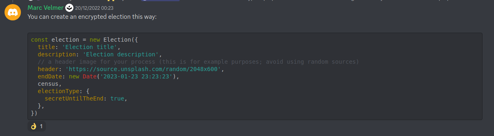

## To create an encrypted election this way:



``` javascript
const election = Election.from({
  title: 'Election title',
  description: 'Election description',
  // a header image for your process (this is for example purposes; avoid using random sources)
  header: 'https://source.unsplash.com/random/2048x600',
  endDate: new Date('2023-01-23 23:23:23'),
  census,
  electionType:{
    secretUntilTheEnd:true
  }
})
```